# F5 Distributed Cloud Synthetic Monitoring Lab Guide

Application observability and digital experience monitoring are crucial for current and future organizations that rely on digital services to support business operations. It is paramount for organizations to ensure their applications are continuously available, performant, and measurable from the external user perspective.

In this lab, your mission is to monitor, validate, and optimize the digital experience of modern applications before real users are impacted. This includes simulating user traffic against application endpoints, measuring real-time and historical health, uptime, and performance, and understanding the impact of application issues across multiple global regions.

By leveraging **F5® Distributed Cloud Synthetic Monitoring**, operations and application teams can reduce Mean Time to Resolution (MTTR) by quickly identifying service degradation, quantifying the blast radius of outages, and establishing a baseline for digital experience metrics. This capability plays a critical business-enabler role by allowing teams to receive timely alerts for critical events and respond proactively before customers report issues.

---
### Lab Introduction

This lab demonstrates how F5 Distributed Cloud Synthetic Monitoring can be used to continuously test web application availability and performance from multiple global locations. The target application is **Arcadia Finance**, which contains multiple services under the same application domain.

- **Service 1**: Arcadia Main  
  URL: https://arcadia.f5xc.cloud/

- **Service 2**: Arcadia Trading  
  URL: https://arcadia.f5xc.cloud/trading/login.php

- **Service 3**: Arcadia API  
  URL: https://arcadia.f5xc.cloud/rest/api/v1


---

## Prerequisites

### Lab Readiness

Ensure LAB environment is ready and running to execute subsequent task.

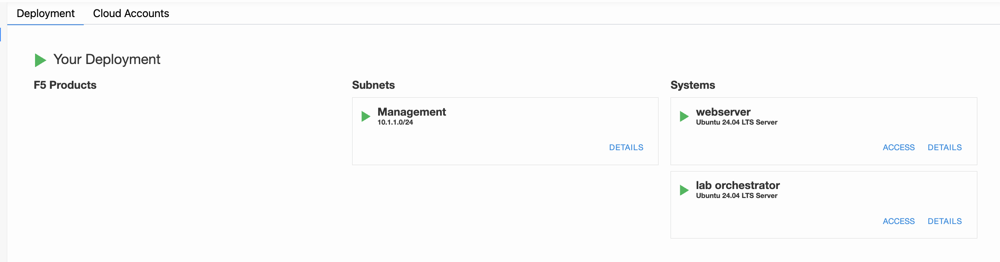

### MyF5 Login

Ensure that you have a MyF5 account using the same email address you used to register for the lab. If you do not have one, please proceed with Sign Up. This step is required to sign in to the F5 XC Dashboard later. Sign in to MyF5 using the following URL: https://account.f5.com/myf5.

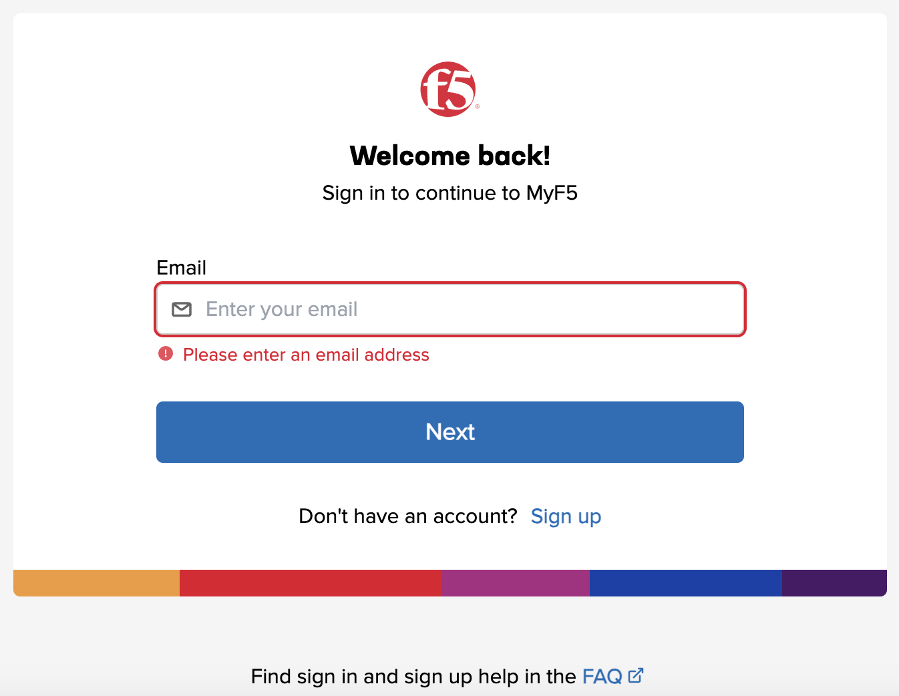

### F5 XC Tenant (f5-xc-lab-sec) Sign in

After the lab environment is ready (Running status with a green icon), you will receive an email from no-reply@cloud.f5.com. Click **Accept Invitation**.

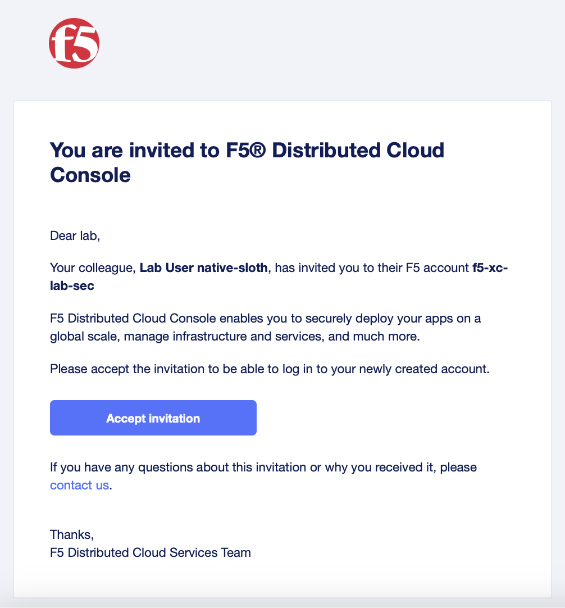

> To successfully sign in to F5 Distributed Cloud tenant, first sign in to MyF5 Account on the same browser.

After accepting the invitation, your browser will open the "f5-xc-lab-sec" tenant sign-in page. Before clicking "Sign in with Okta", you must first sign in to your MyF5 account using the same browser.

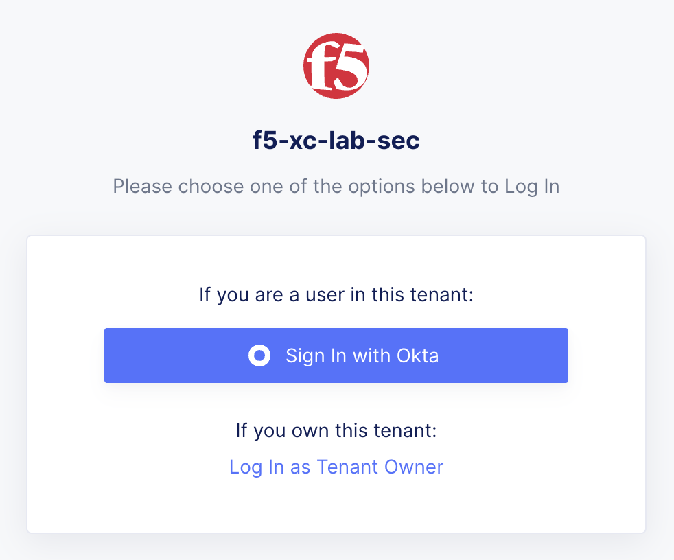

If you successfully sign in to the F5 Distributed Cloud tenant, you will see the following page. Review the End User Services Agreement and F5 Privacy Policy, then click **Accept and Agree**.

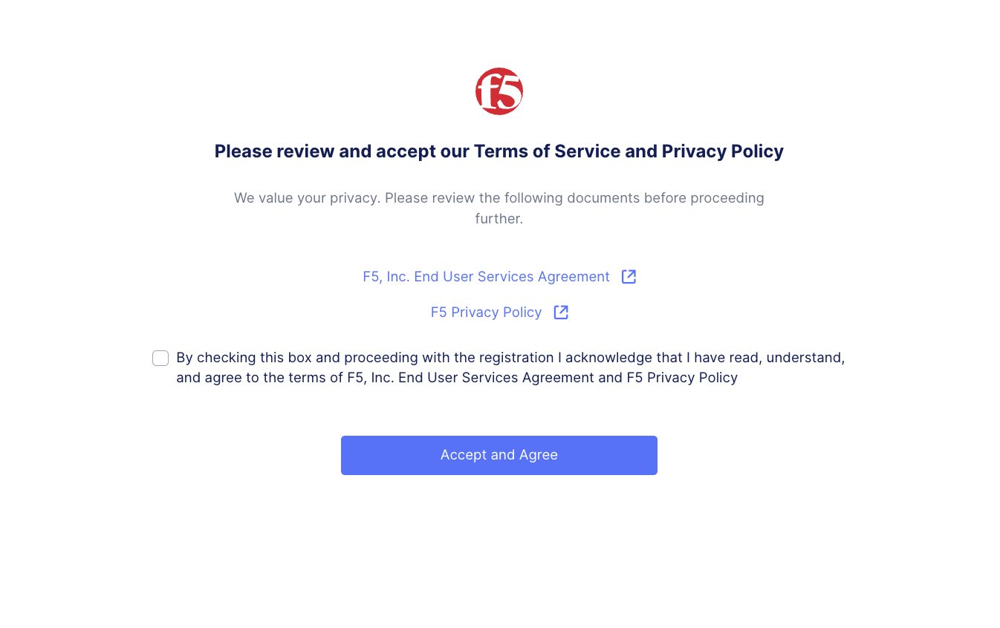

Select all roles, then click **Next**

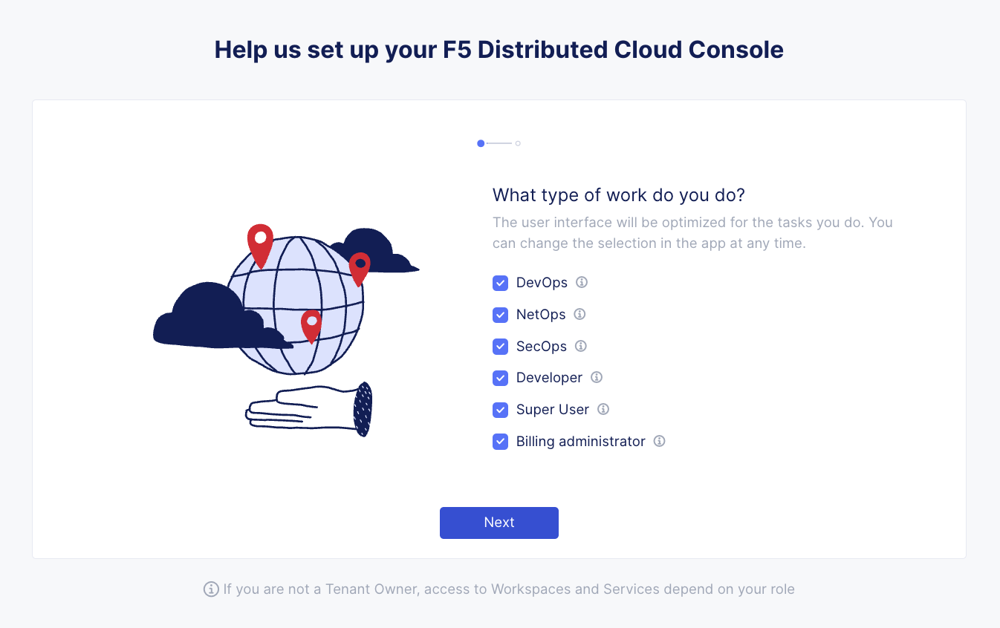

Choose **Advanced**, then click **Get Started**

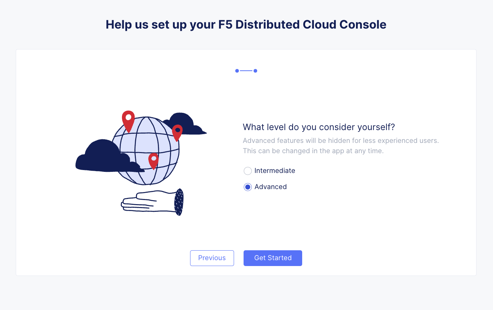

---

## Start Lab

### Learning Objectives

- Create HTTP synthetic monitors for multiple Arcadia Finance endpoints.
- Configure monitor validation using status codes and receive strings.
- Run monitors from selected AWS and F5 Distributed Cloud locations.
- Observe service-level health and identify intermittent behaviour under the same application domain.
- Configure alert receiver, create alert policy and validate critical alert emails.
- Review TLS score, TLS detailed report, and PDF export from HTTP monitors.
- Create & Observe DNS synthetic monitors for Arcadia domain.

Access Synthetic Monitoring Dashboard by navigating to **Observability** from the home page of F5 Distributed Cloud Console

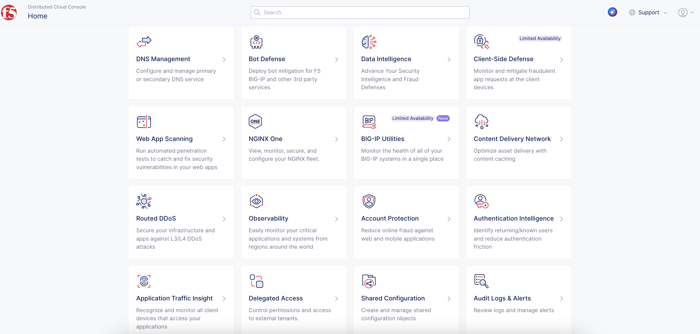
---

## 1 - Configure HTTP Synthetic Monitors (Arcadia Main, Trading, API)

In this section, create three HTTP monitors. Each monitor targets a different Arcadia Finance endpoint so students can compare the availability of application services from the same domain.

> Use consistent locations and threshold values across all monitors. This makes it easier to compare results across the Main Page, Trading Service, and API Service.

### 1.1 - Add 1st HTTP Monitor: Arcadia Main Page

This monitor validates that the main Arcadia Finance home page is reachable and returns the expected application content.

Navigate to **Observability > Manage > Synthetic Monitors > HTTP Monitors**. Click **Add HTTP Monitor**

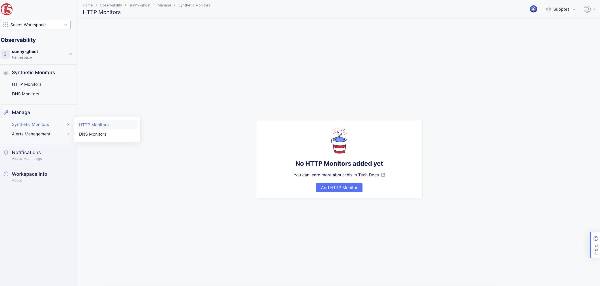

| Section | Parameter | Value |
|---------|-----------|-------|
| **Metadata** | Name | `arcadia-main` |

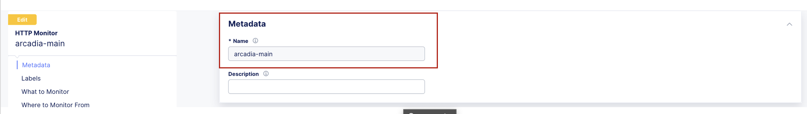

| Section | Parameter | Value |
|---------|-----------|-------|
| **What to Monitor** | URL | `https://arcadia.f5xc.cloud` |
| | Interval | 1 minute |
| | Method | GET |
| | Valid Response Code | 2**, 3**, 4** |
| | Receive String | `Financial Expert Advice` |

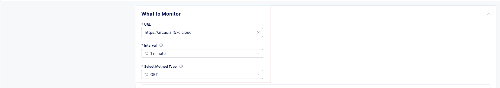

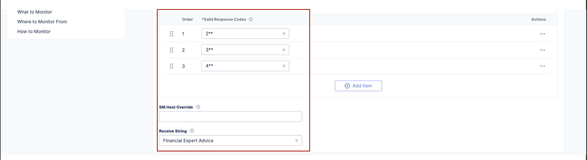

| Section | Parameter | Value |
|---------|-----------|-------|
| **Where to Monitor From** | AWS | ap-southeast-1, ap-southeast-2, ap-northeast-1, ap-south-1, ap-east-1 |
| | F5 Distributed Cloud | ves-io-sydney, ves-io-jakarta, ves-io-tokyo, ves-io-singapore, ves-io-hongkong |

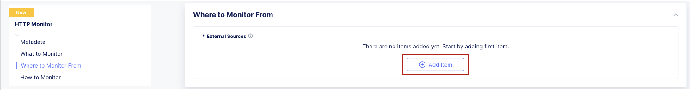

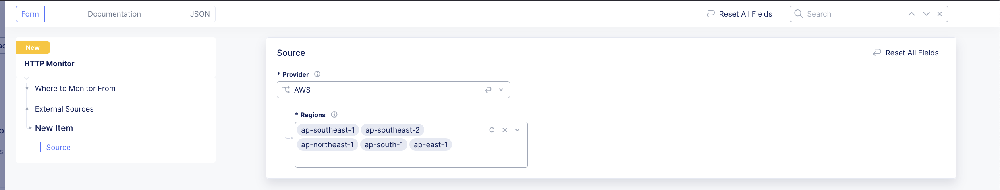

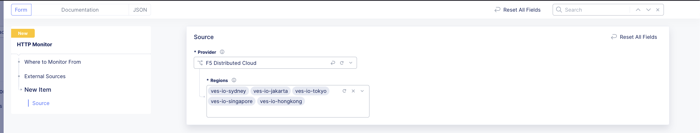

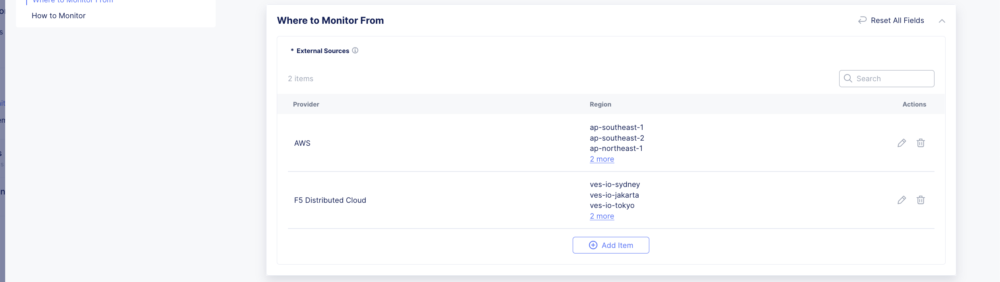


| Section | Parameter | Value |
|---------|-----------|-------|
| **How to Monitor** | Response Timeout | 5000 ms |
| | Number of Consecutive Test Failures | 1 |
| | Number of Failed Locations | 3 |
| | Ignore Cert Error | True |
| | Follow Redirects | True |

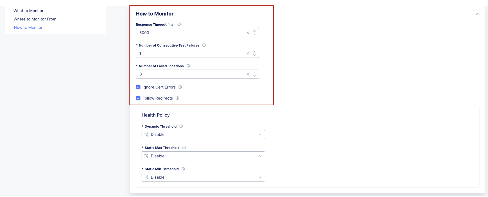

Click **Add HTTP Monitor**

---

### 1.2 - Add 2nd HTTP Monitor: Arcadia Trading

This monitor validates that the main Arcadia Trading Service. Repeat from the previous steps with following parameters:

| Section | Parameter | Value |
|---------|-----------|-------|
| **Metadata** | Name | `arcadia-trading` |

| Section | Parameter | Value |
|---------|-----------|-------|
| **What to Monitor** | URL | `https://arcadia.f5xc.cloud/trading/login.php` |
| | Interval | 1 minute |
| | Method | GET |
| | Valid Response Code | 2**, 3**, 4** |
| | Receive String | `Login Form` |

| Section | Parameter | Value |
|---------|-----------|-------|
| **Where to Monitor From** | AWS | ap-southeast-1, ap-southeast-2, ap-northeast-1, ap-south-1, ap-east-1 |
| | F5 Distributed Cloud | ves-io-sydney, ves-io-jakarta, ves-io-tokyo, ves-io-singapore, ves-io-hongkong |

| Section | Parameter | Value |
|---------|-----------|-------|
| **How to Monitor** | Response Timeout | 5000 ms |
| | Number of Consecutive Test Failures | 1 |
| | Number of Failed Locations | 3 |
| | Ignore Cert Error | True |
| | Follow Redirects | True |

---

### 1.3 - Add 3rd HTTP Monitor: Arcadia API

This monitor validates that the main Arcadia API Service. Repeat from the previous steps with following parameters:

| Section | Parameter | Value |
|---------|-----------|-------|
| **Metadata** | Name | `arcadia-api` |

| Section | Parameter | Value |
|---------|-----------|-------|
| **What to Monitor** | URL | `https://arcadia.f5xc.cloud/rest/api/v1` |
| | Interval | 1 minute |
| | Method | GET |
| | Valid Response Code | 2**, 3**, 4** |
| | Receive String | `Arcadia Finance API` |

| Section | Parameter | Value |
|---------|-----------|-------|
| **Where to Monitor From** | AWS | ap-southeast-1, ap-southeast-2, ap-northeast-1, ap-south-1, ap-east-1 |
| | F5 Distributed Cloud | ves-io-sydney, ves-io-jakarta, ves-io-tokyo, ves-io-singapore, ves-io-hongkong |

| Section | Parameter | Value |
|---------|-----------|-------|
| **How to Monitor** | Response Timeout | 5000 ms |
| | Number of Consecutive Test Failures | 1 |
| | Number of Failed Locations | 3 |
| | Ignore Cert Error | True |
| | Follow Redirects | True |

All 3 HTTP monitors configured shown in the picture

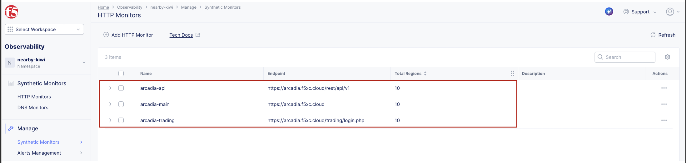
---

## 2 - Observe HTTP Synthetic Monitors (Arcadia Main, Trading, API)


Navigate to **Synthetic Monitors > HTTP Monitors > Dashboard**. Here you can view the status of all HTTP monitors.

Newly created monitors typically require 3–5 minutes before monitoring data becomes available. Wait approximately 5–10 minutes for additional monitoring data to be collected.

After about 10 minutes, you will observe that one HTTP Monitor repeatedly transitions to a Critical state, shown by the red line fluctuating on the graph. If you refresh the page during one of these periods, the Current HTTP Monitor Status may show 1 Critical.

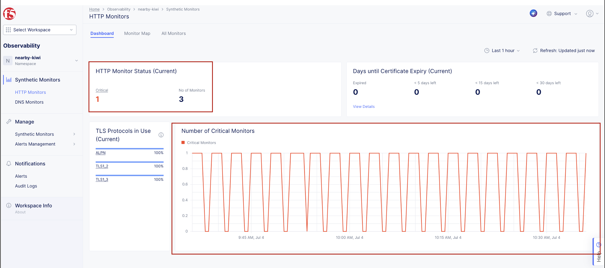

Next, let's examine each HTTP Monitor individually.

### 2a. Observe Arcadia Main

First, observe the first HTTP monitor, arcadia-main.

Navigate to **Synthetic Monitors > HTTP Monitors > All Monitors**. Click `arcadia-main`.

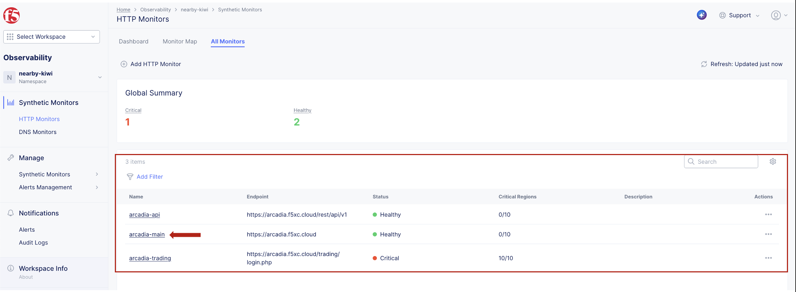

Select the **Last 1 Hour** time period. Observe on **Global Summary**, HTTP monitor status is **Healthy**. With Current, Avg, and Max Latency.

Observe **Global Response Time Breakdown**. This can be used to analyze detailed latency for DNS Lookup, TCP Connection, TLS Handshake Server Processing and Content Transfer.

> Global value is calculated by average from all regions configured

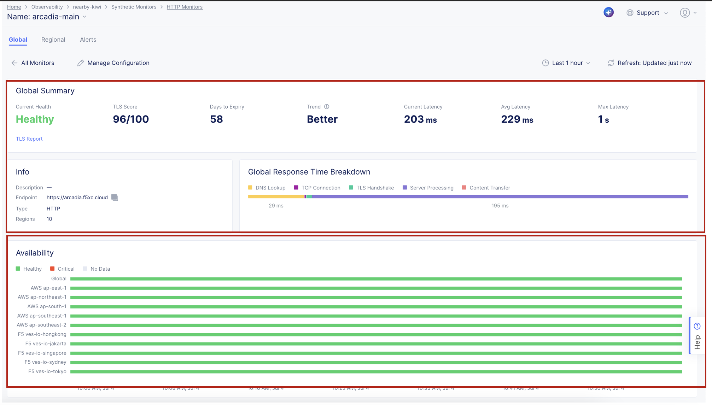

Scroll down to the **Response Time by Region** section. Previously, we configured Where to Monitor From by selecting five AWS regions and five F5 Distributed Cloud regions. The graph shows the response time reported from each monitoring region, allowing you to compare application performance across different geographic locations.

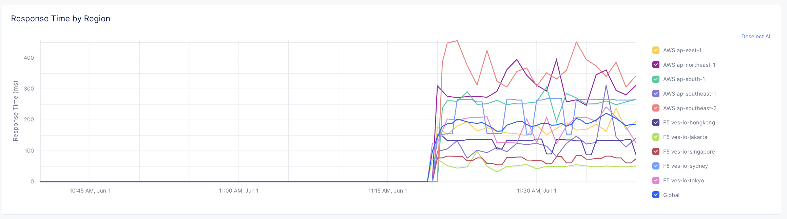

Click the Regions tab to view the response time breakdown for each monitoring region. You can observe the response time and health status reported from each location.

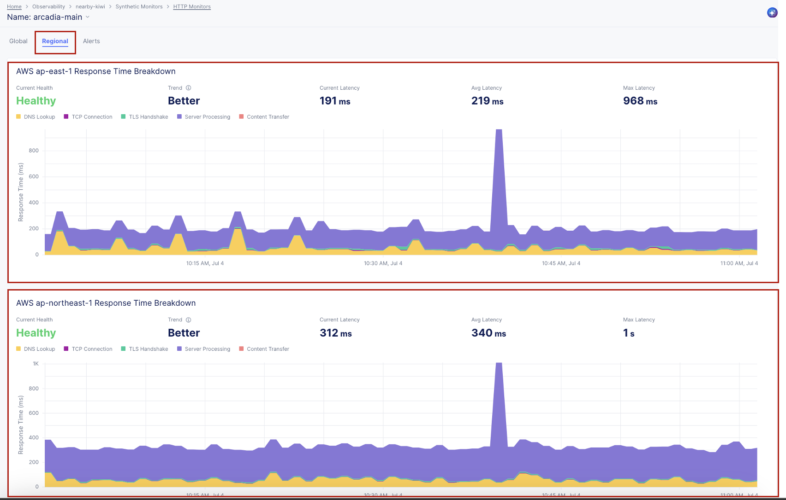

The Main service is in a Healthy state.

### 2b. Observe Arcadia Trading

Navigate to **Synthetic Monitors > HTTP Monitors > All Monitors**. Click `arcadia-trading`.

> You can also switch HTTP Monitor from drop down on the top.

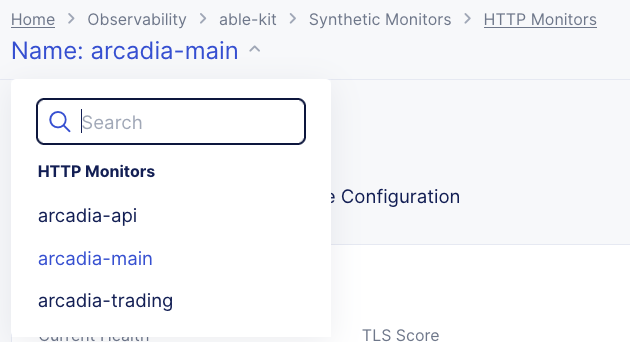

The HTTP Monitor for `arcadia-trading` changes between **Critical** and **Healthy** status across the majority of regions because the application is experiencing intermittent outages.

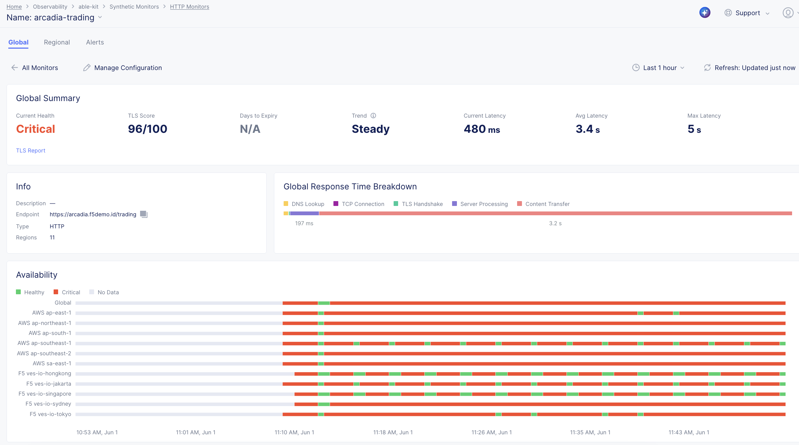

Scroll down to **Response Time by Region**, observe that the response times are significantly higher.

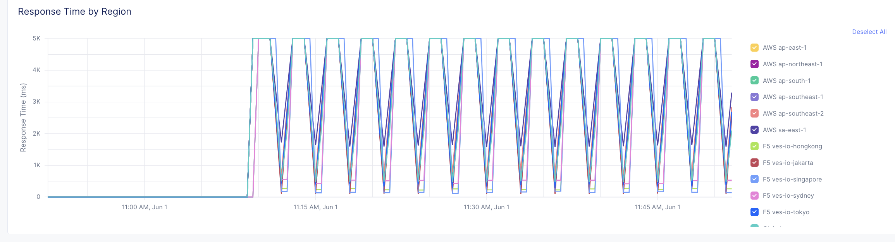

Under **Events**, you may see some time out logs:

```
Get "http://arcadia.f5xc.cloud/trading/login.php": context deadline exceeded (Client.Timeout exceeded while awaiting headers)
```
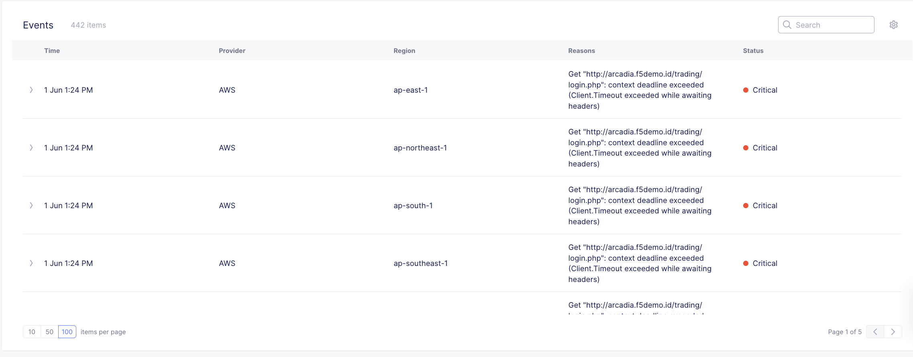

Based on above behavior, the Trading service is on intermittent state.

---

### 2c. Observe Arcadia API

Navigate to **Synthetic Monitors > HTTP Monitors > All Monitors**. Click `arcadia-api`.

> You can also switch HTTP Monitor from drop down on the top.


HTTP Monitor on `arcadia-api` shown **Healthy** Status. No time out from all regions.

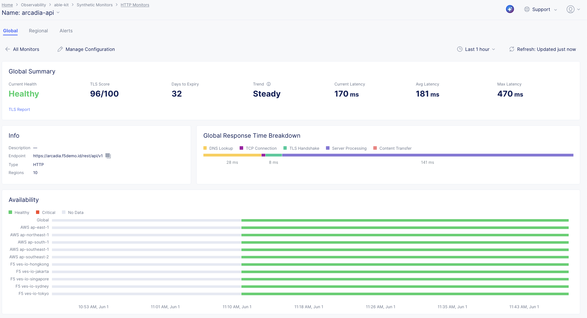
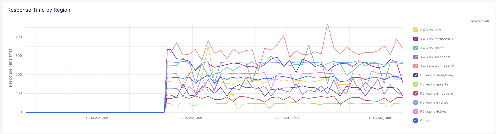

The API service is in a Healthy state.

Based on the three conditions above, the Main and API services remain healthy, while the Trading service experiences intermittent availability. This demonstrates how Synthetic Monitoring provides service-level visibility, enabling you to identify when an individual service becomes intermittent or unhealthy within a single application.

---

### Advanced Health Policy

The Healthy/Critical status is determined by the configuration of "How to Monitor" and "Health Policy." Previously, we configured only the timeout setting. Now, we will configure a threshold policy.

Let's change `arcadia-main` Health Policy Static Max Threshold to 200 ms.

Click on **Manage Configuration** on the top left

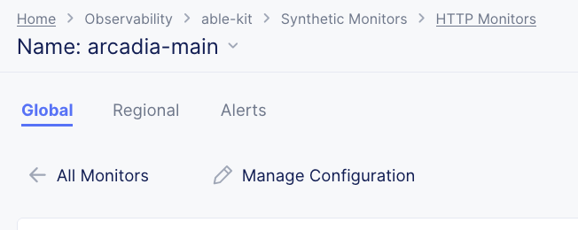

Click **Edit Configuration**

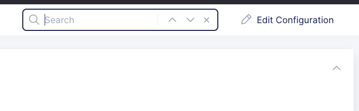

Scroll down to **Health Policy > Static Max Threshold > Set Max Response Time** to `200 ms`. **Evaluation Period** to `3 minutes`.

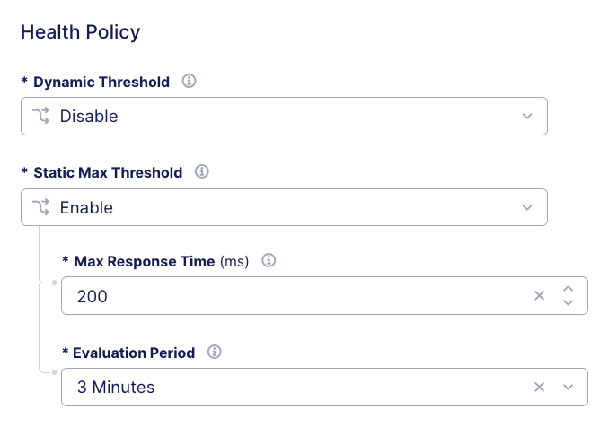

Click **Save HTTP Monitor**


The results will show several regions. In the example below, AWS ap-southeast-2 and AWS ap-northeast-1 have response times above 200 ms and are displayed in red.


> Depends on the Monitoring source, you may get time out from different Region

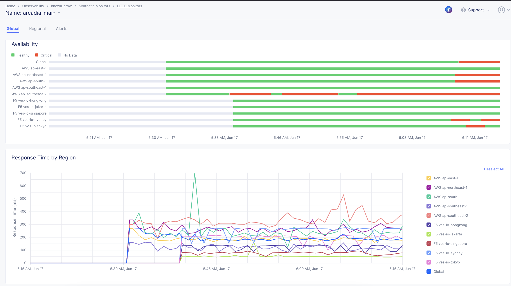


***End of Section***

---

## 3 – Alert Policy

Let's create an alert receiver and alert policy to send email alerts for critical events.

### Create Alert Receiver

Navigate to **Manage > Alerts Management > Alert Receivers**. Add Alert Receiver.

| Parameter | Value |
|-----------|-------|
| Name | `email-alert-receiver` |
| Receiver | Email |
| Email | `<enter your email>` |
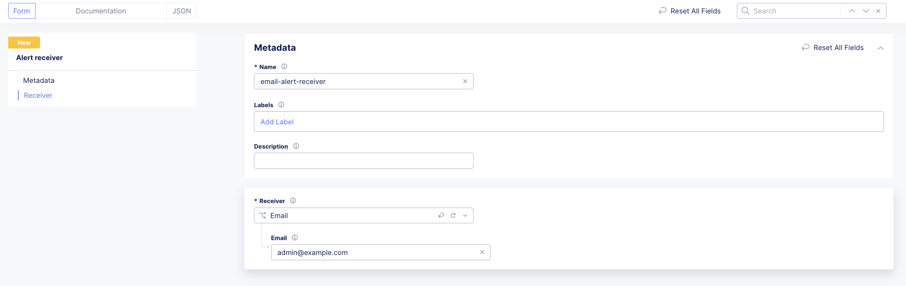


Click **Add Receiver**

After created, click on three dots on the right > **Verify Email**. Click **Send email**
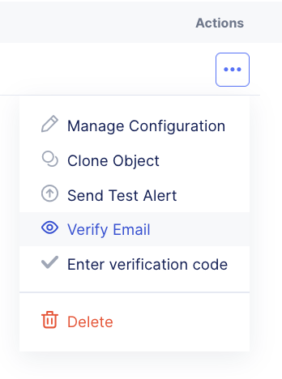
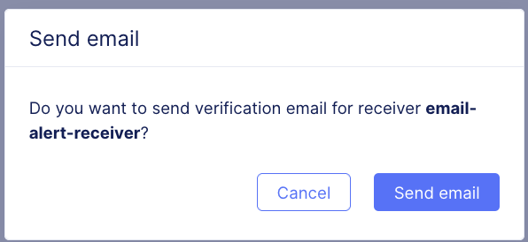


Check the email address you entered. You will receive an email containing a verification code, similar to the example below.

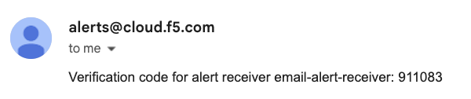

Click on three dots > **Enter Verification Code > Verify Receiver**

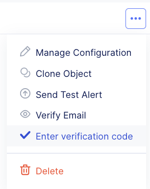
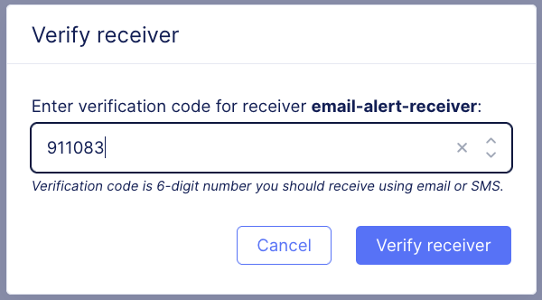


Click on three dots > **Send Test Alert**. Click **Send Test Alert**

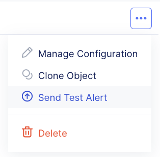


You'll receive email similar like this.
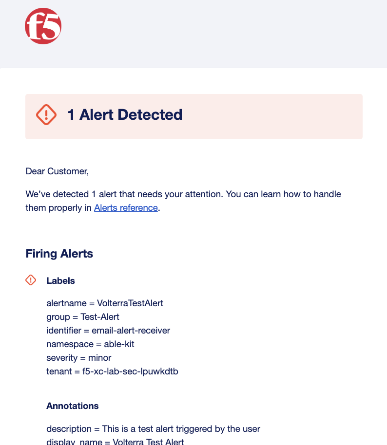


### Create Alert Policy

Navigate to **Manage > Alerts Management > Alert Policies**. Add Alert Policy.

| Parameter | Value |
|-----------|-------|
| Name | `monitoring-alert-policy` |
| Alert Receiver | `email-alert-receiver` |
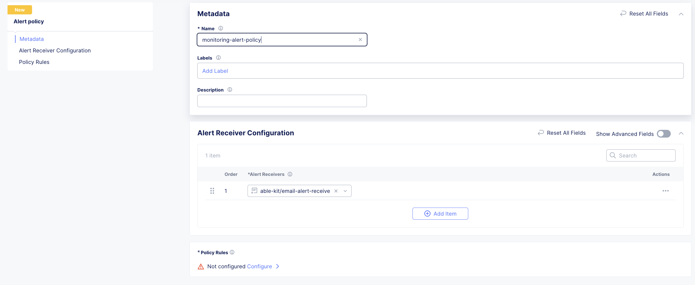


On **Policy Rules**, click **Configure > Add Item**

Enable **Show Advanced Fields**.

| Parameter | Value |
|-----------|-------|
| Select Alerts | Matching Alertname |
| Matching Alertname | `SyntheticMonitorHealthCritical` |
| Action | Send |
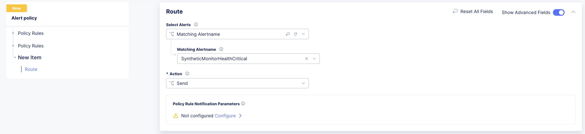


On **Policy Rule Notification Parameters**, click **Configure**

| Parameter | Value |
|-----------|-------|
| Notify Interval For a Alert | 30m |
| Wait to Notify | 30s |
| Notify Interval for a Group | 1m |
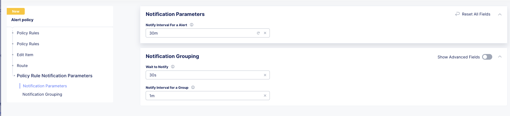


Click **Apply > Add Alert Policy**

### Activate Alert Policy

Navigate to **Manage > Alerts Management > Active Alert Policies**. Click **Manage Active Alert Policy**.
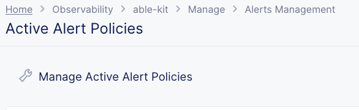


Add item > select `monitoring-alert-policy`. Click **Save Active Alert Policies**
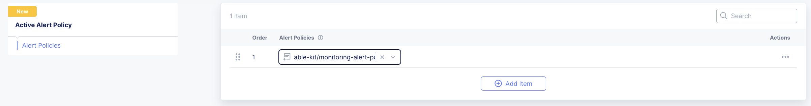


After ~10 minutes, you will receive alert on email for Critical Status on Arcadia-Trading HTTP Monitor. Below is the example email alert.
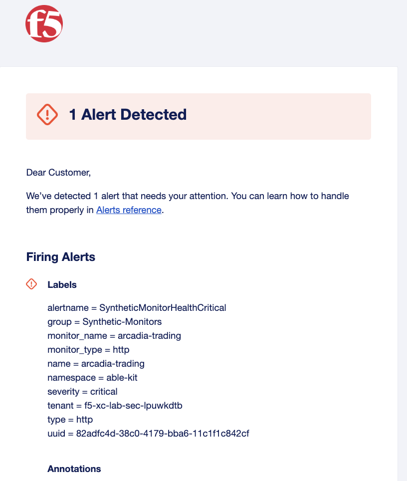


***End of Section***

---

## 4 – TLS Report

Add another HTTP Monitor for the TLS Report. Configure only the parameters listed below and leave all other parameters at their default values.

| Section | Parameter | Value |
|---------|-----------|-------|
| **Metadata** | Name | `vuln-bank` |

| Section | Parameter | Value |
|---------|-----------|-------|
| **What to Monitor** | URL | `https://vulnbank.demoapp.site` |

| Section | Parameter | Value |
|---------|-----------|-------|
| **Where to Monitor From** | F5 Distributed Cloud | ves-io-sydney, ves-io-jakarta, ves-io-tokyo, ves-io-singapore, ves-io-hongkong |
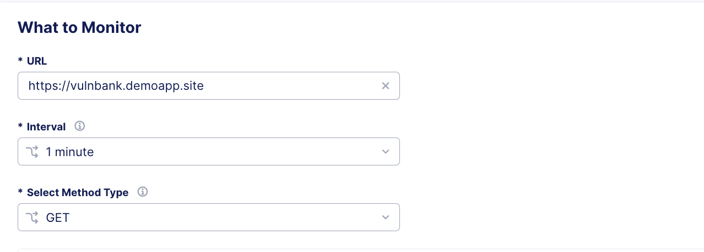
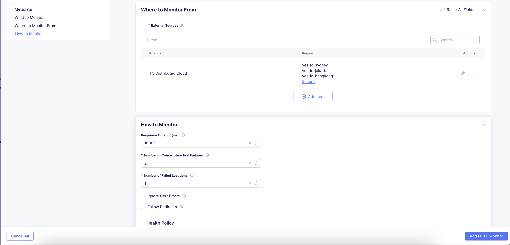

Click **Add HTTP Monitor**


### View TLS Report

Navigate to **Synthetic Monitors > HTTP Monitors > All Monitors**. Click `vuln-bank`.

After 5–10 minutes, the TLS Score will appear. Click **TLS Report**. A sidebar will open displaying the TLS report. Observe that the **TLS Rating is B** and the **TLS Score is 94/100**.
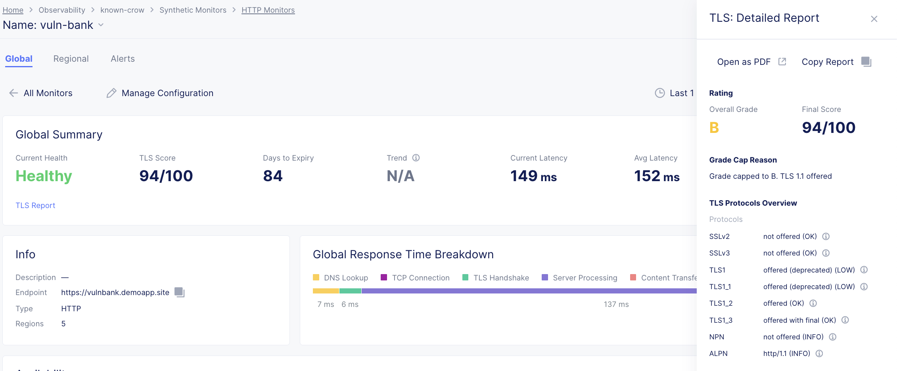


Click on **Open as PDF** to see detailed report. It will open pop up or new tab.
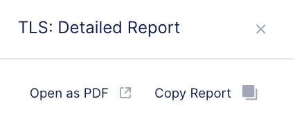


Below is an example of a TLS Report. Refer to the PDF to review the detailed TLS report.
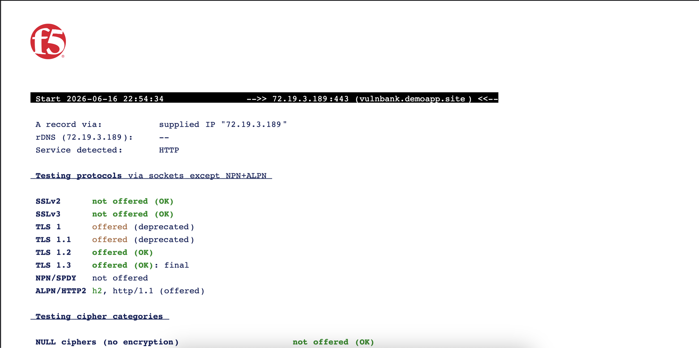
### Compare TLS Reports

Let's observe TLS Report for other HTTP Monitors previously configured.

Navigate to **Synthetic Monitors > HTTP Monitors > All Monitors**. Click `arcadia-main`. Or navigate via drop down on the top.

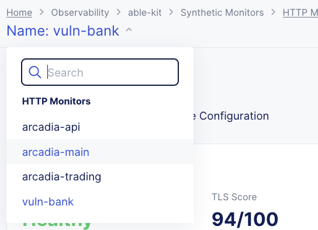

Observe `arcadia-main` has higher **TLS Score (96/100)**, higher **Rating (A+)**

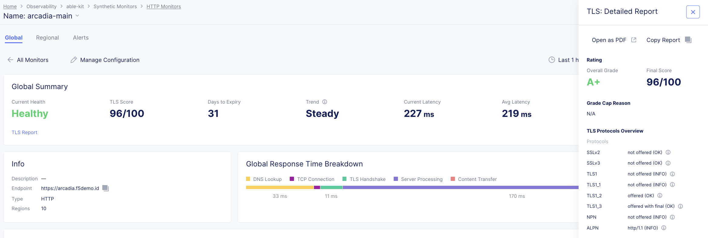

Click on **Open as PDF** to see detailed report. It will open pop up or new tab.


Refer to the PDF to review the detailed TLS report.
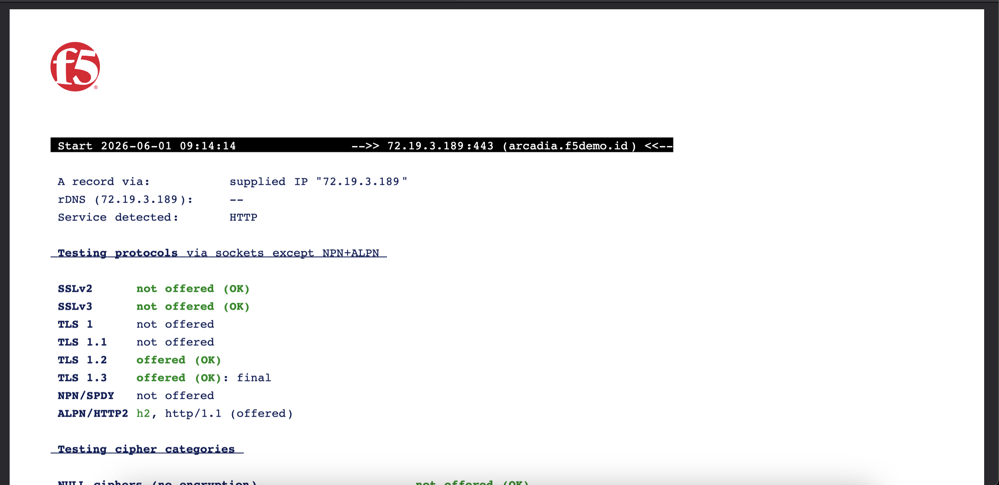
***End of Section***

---

## 5 – DNS Monitor

### Create DNS Monitor

Navigate to **Observability > Manage > Synthetic Monitors > DNS Monitors**. Click **Add DNS Monitor**

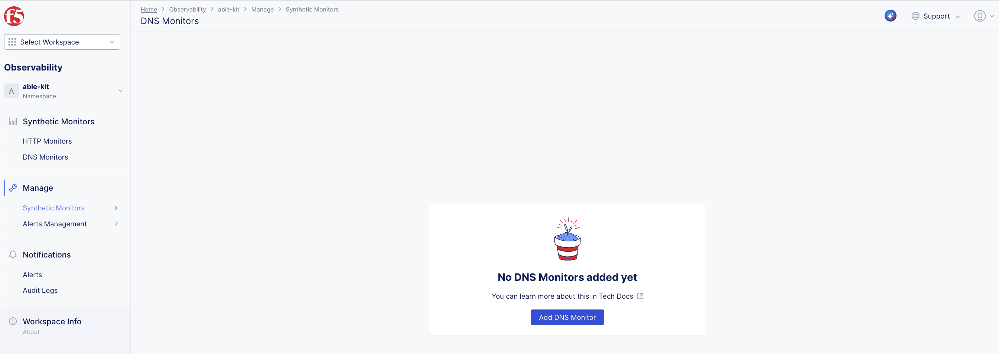

| Section | Parameter | Value |
|---------|-----------|-------|
| **Metadata** | Name | `arcadia-dns` |

| Section | Parameter | Value |
|---------|-----------|-------|
| **What to Monitor** | Domain | `arcadia.f5xc.cloud` |
| | Record Type | A |
| | Interval | 30 Seconds |
| | Protocol | UDP |

| Section | Parameter | Value |
|---------|-----------|-------|
| **Where to Monitor From** | AWS | ap-southeast-1, ap-southeast-2, ap-northeast-1, ap-south-1, ap-east-1 |
| | F5 Distributed Cloud | ves-io-sydney, ves-io-jakarta, ves-io-tokyo, ves-io-singapore, ves-io-hongkong |

Click **Add DNS Monitor**


### Observe DNS Monitor

Navigate to **Synthetic Monitors > DNS Monitors > All Monitors Tab**. Click `arcadia-dns`

Wait 5-10 minutes.

Observe DNS Monitoring Global Summary for arcadia is **healthy**. With Current, Average and Max Latency.
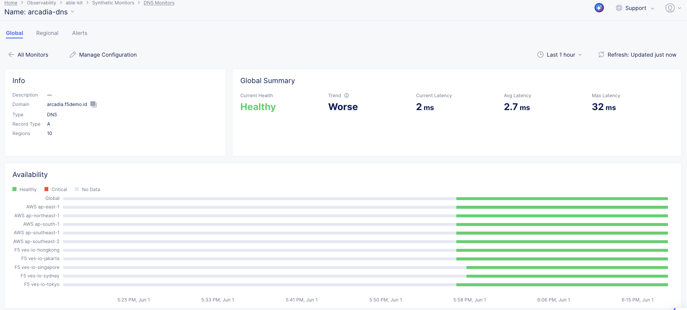


> Global value is calculated by average from all regions configured


Scroll down to observe **Response Time by Region**
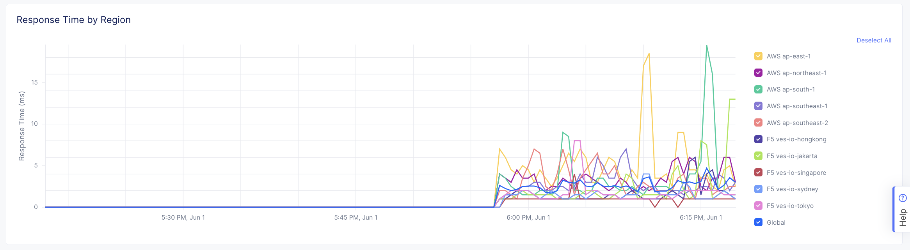
***End of Section***
