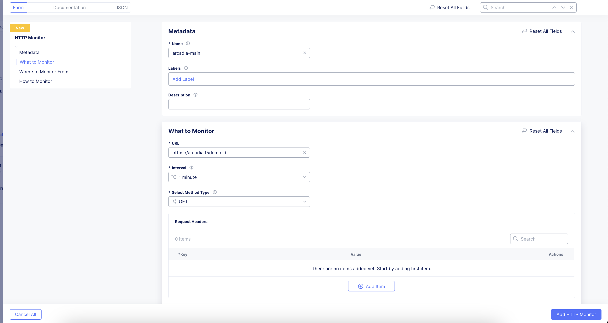
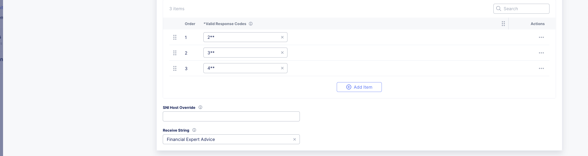
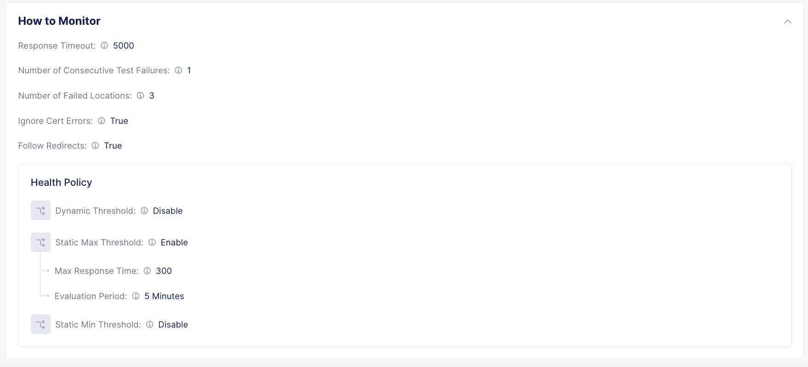
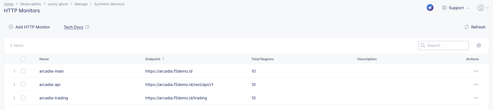
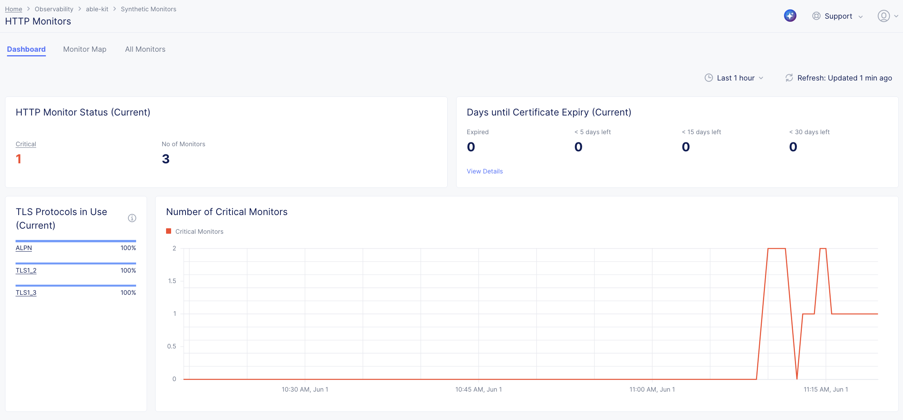
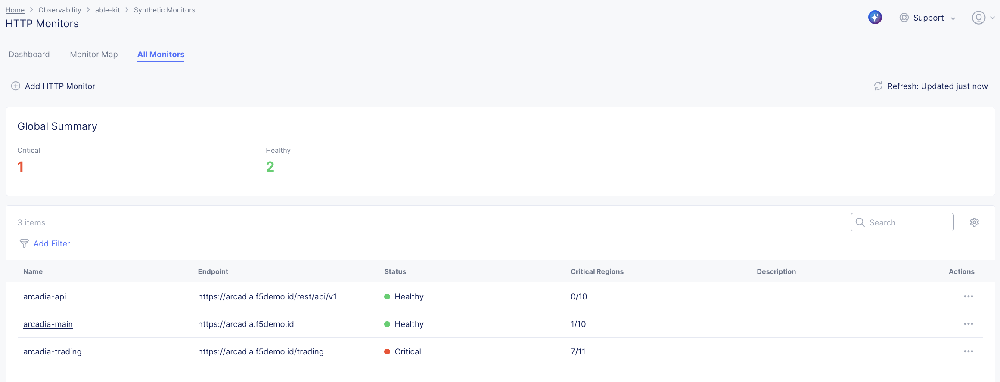
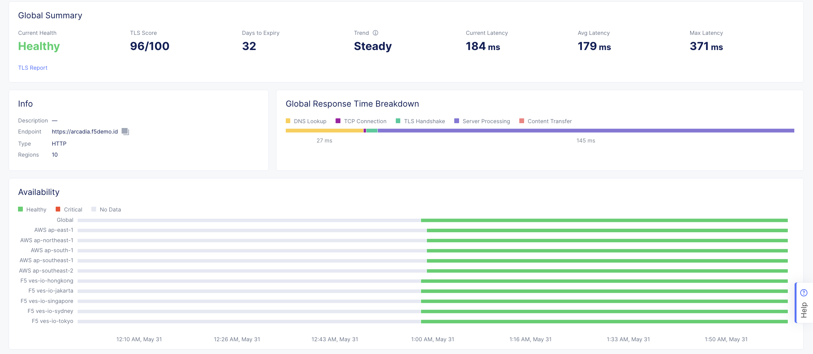
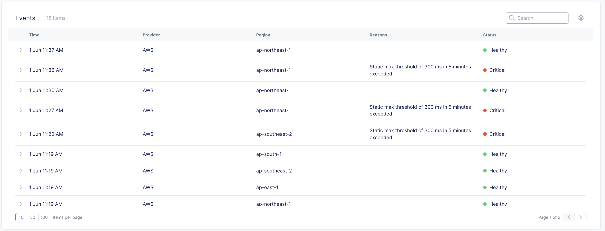
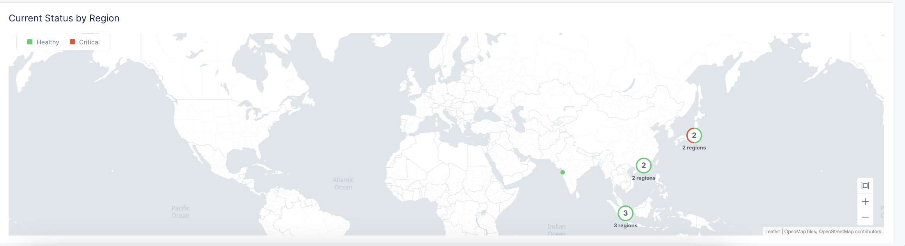

# F5 Distributed Cloud Synthetic Monitoring Lab Guide


## Application Observability and Digital Experience Monitoring

Application observability and digital experience monitoring are crucial for current and future organizations that rely on digital services to support business operations. It is paramount for organizations to ensure their applications are continuously available, performant, and measurable from the external user perspective.

In this lab, your mission is to monitor, validate, and optimize the digital experience of modern applications before real users are impacted. This includes simulating user traffic against application endpoints, measuring real-time and historical health, uptime, and performance, and understanding the impact of application issues across multiple global regions.

By leveraging **F5® Distributed Cloud Synthetic Monitoring**, operations and application teams can reduce Mean Time to Resolution (MTTR) by quickly identifying service degradation, quantifying the blast radius of outages, and establishing a baseline for digital experience metrics. This capability plays a critical business-enabler role by allowing teams to receive timely alerts for critical events and respond proactively before customers report issues.

---

## Prerequisites

### Readiness

1. Ensure LAB environment is ready and running to execute subsequent task.

2. Ensure that you have a MyF5 account using the same email address you used to register for the lab. If you do not have one, please proceed with Sign Up. This step is required to sign in to the F5 XC Dashboard later.

3. Sign in to MyF5 using the following URL: https://account.f5.com/myf5


4. After the lab environment is ready (Running status with a green icon), you will receive an email from `no-reply@cloud.f5.com`. Click **Accept Invitation**.


5. To successfully sign in to F5 Distributed Cloud tenant, first sign in to MyF5 Account on the same browser.

6. After accepting the invitation, your browser will open the "f5-xc-lab-sec" tenant sign-in page. Before clicking "Sign in with Okta", you must first sign in to your MyF5 account using the same browser.


7. If you successfully sign in to the F5 Distributed Cloud tenant, you will see the following page. Review the End User Services Agreement and F5 Privacy Policy, then click **Accept and Agree**.


8. Select all roles, then click **Next**


9. Choose **Advanced**, then click **Get Started**


---

## Start Lab

### Learning Objectives

- Create HTTP synthetic monitors for multiple Arcadia Finance endpoints.
- Configure monitor validation using status codes and receive strings.
- Run monitors from selected AWS and F5 Distributed Cloud locations.
- Observe service-level health and identify intermittent behaviour under the same application domain.
- Configure alert receiver, create alert policy and validate critical alert emails.
- Review TLS score, TLS detailed report, and PDF export from HTTP monitors.
- Create & Observe DNS synthetic monitors for Arcadia domain.

---

## Lab Introduction

This lab demonstrates how F5 Distributed Cloud Synthetic Monitoring can be used to continuously test web application availability and performance from multiple global locations. The target application is **Arcadia Finance**, which contains multiple services under the same application domain.

| Service | URL |
|---------|-----|
| **Service 1: Arcadia Main** | https://arcadia.f5xc.cloud/ |
| **Service 2: Arcadia Trading** | https://arcadia.f5xc.cloud/trading/login.php |
| **Service 3: Arcadia API** | https://arcadia.f5xc.cloud/rest/api/v1 |

Access Synthetic Monitoring Dashboard by navigating to **Observability** from the home page of F5 Distributed Cloud Console.


---

## 1 - Configure HTTP Synthetic Monitors

In this section, create three HTTP monitors. Each monitor targets a different Arcadia Finance endpoint so students can compare the availability of application services from the same domain.

> **Note:** Use consistent locations and threshold values across all monitors. This makes it easier to compare results across the Main Page, Trading Service, and API Service.

### 1.1 - Add 1st HTTP Monitor: Arcadia Main Page

This monitor validates that the main Arcadia Finance home page is reachable and returns the expected application content.

Navigate to **Observability > Manage > Synthetic Monitors > HTTP Monitors**. Click **Add HTTP Monitor**


| Section | Parameter | Value |
|---------|-----------|-------|
| **Metadata** | Name | `arcadia-main` |
| **What to Monitor** | URL | `https://arcadia.f5xc.cloud` |
| | Interval | 1 minute |
| | Method | GET |
| | Valid Response Code | 2**, 3**, 4** |
| | Receive String | `Financial Expert Advice` |
| **Where to Monitor From** | AWS | ap-southeast-1, ap-southeast-2, ap-northeast-1, ap-south-1, ap-east-1 |
| | F5 Distributed Cloud | ves-io-sydney, ves-io-jakarta, ves-io-tokyo, ves-io-singapore, ves-io-hongkong |
| **How to Monitor** | Response Timeout | 5000 ms |
| | Number of Consecutive Test Failures | 1 |
| | Number of Failed Locations | 3 |
| | Ignore Cert Error | True |
| | Follow Redirects | True |

Click **Add HTTP Monitor**


---

### 1.2 - Add 2nd HTTP Monitor: Arcadia Trading

This monitor validates that the main Arcadia Trading Service. Repeat from the previous steps with following parameters:

| Section | Parameter | Value |
|---------|-----------|-------|
| **Metadata** | Name | `arcadia-trading` |
| **What to Monitor** | URL | `https://arcadia.f5xc.cloud/trading/login.php` |
| | Interval | 1 minute |
| | Method | GET |
| | Valid Response Code | 2**, 3**, 4** |
| | Receive String | `Login Form` |
| **Where to Monitor From** | AWS | ap-southeast-1, ap-southeast-2, ap-northeast-1, ap-south-1, ap-east-1 |
| | F5 Distributed Cloud | ves-io-sydney, ves-io-jakarta, ves-io-tokyo, ves-io-singapore, ves-io-hongkong |
| **How to Monitor** | Response Timeout | 5000 ms |
| | Number of Consecutive Test Failures | 1 |
| | Number of Failed Locations | 3 |
| | Ignore Cert Error | True |
| | Follow Redirects | True |

---

### 1.3 - Add 3rd HTTP Monitor: Arcadia API

This monitor validates that the main Arcadia API Service. Repeat from the previous steps with following parameters:

| Section | Parameter | Value |
|---------|-----------|-------|
| **Metadata** | Name | `arcadia-api` |
| **What to Monitor** | URL | `https://arcadia.f5xc.cloud/rest/api/v1` |
| | Interval | 1 minute |
| | Method | GET |
| | Valid Response Code | 2**, 3**, 4** |
| | Receive String | `Arcadia Finance API` |
| **Where to Monitor From** | AWS | ap-southeast-1, ap-southeast-2, ap-northeast-1, ap-south-1, ap-east-1 |
| | F5 Distributed Cloud | ves-io-sydney, ves-io-jakarta, ves-io-tokyo, ves-io-singapore, ves-io-hongkong |
| **How to Monitor** | Response Timeout | 5000 ms |
| | Number of Consecutive Test Failures | 1 |
| | Number of Failed Locations | 3 |
| | Ignore Cert Error | True |
| | Follow Redirects | True |

All 3 HTTP monitors configured shown in the picture.



---

## 2 - Observe HTTP Synthetic Monitors

> **Note:** Currently newly created monitors take ~2-3 min before data is available.

Navigate to **Synthetic Monitors > HTTP Monitors > Dashboard Tab**. Here you can see HTTP Monitor Status. There's 1 HTTP Monitor with Critical Status. Let's observe each HTTP Monitor.



### Observe arcadia-main

1. Navigate to **Synthetic Monitors > HTTP Monitors > All Monitors**. Click `arcadia-main`.


2. Select the **Last 1 Hour** time period.

3. Observe on **Global Summary**, HTTP monitor status is **Healthy**. With Current, Avg, and Max Latency.

4. Observe **Global Response Time Breakdown**. This can be used to analyze detailed latency for:
   - DNS Lookup
   - TCP Connection
   - TLS Handshake
   - Server Processing
   - Content Transfer


> **Note:** Global value is calculated by average from all regions configured.

5. Scroll down to observe **Response Time by Region**. Previously, we configured "Where to Monitor From" by selecting 5 regions from AWS and 5 regions from F5 Distributed Cloud.



6. Scroll down to observe **Events & Current Status by Region**.





### Observe arcadia-api

Navigate to **Synthetic Monitors > HTTP Monitors > All Monitors**. Click `arcadia-api`.

> **Tip:** You can also switch HTTP Monitor from drop down on the top.



HTTP Monitor on `arcadia-api` shown **Healthy** Status. No time out from all regions.



### Observe arcadia-trading

Navigate to **Synthetic Monitors > HTTP Monitors > All Monitors**. Click `arcadia-trading`.

> **Tip:** You can also switch HTTP Monitor from drop down on the top.


HTTP Monitor on `arcadia-trading` shown **Critical** status across the majority of regions. This is due to time out.



Scroll down to **Response Time by Region**, observe that the response times are significantly higher.



Under **Events**, you observe time out logs:


```
Get "http://arcadia.f5xc.cloud/trading/login.php": context deadline exceeded (Client.Timeout exceeded while awaiting headers)
```

> **Important:** The Arcadia Trading service is experiencing an issue. This behaviour demonstrates that even within a single application, Synthetic Monitoring can detect when an individual service becomes intermittent or unhealthy.

---

### Advanced Health Policy

The Healthy/Critical status is determined by the configuration of "How to Monitor" and "Health Policy." Previously, we configured only the timeout setting. Now, we will configure a threshold policy.

Let's change `arcadia-main` Health Policy Static Max Threshold to 200 ms.

1. Click on **Manage Configuration** on the top left


2. Click **Edit Configuration**


3. Scroll down to **Health Policy > Static Max Threshold > Set Max Response Time** to `200 ms`. **Evaluation Period** to `3 minutes`.


4. Click **Save HTTP Monitor**

The results will show several regions. In the example below, AWS ap-southeast-2 and AWS ap-northeast-1 have response times above 200 ms and are displayed in red.


> **Note:** Depends on the Monitoring source, you may get time out from different Region.

***End of Section***

---

## 3 – Alert Policy

Let's create an alert receiver and alert policy to send email alerts for critical events.

### Create Alert Receiver

1. Navigate to **Manage > Alerts Management > Alert Receivers**. Add Alert Receiver.

| Parameter | Value |
|-----------|-------|
| Name | `email-alert-receiver` |
| Receiver | Email |
| Email | `<enter your email>` |


2. Click **Add Receiver**

3. After created, click on three dots on the right > **Verify Email**. Click **Send email**


4. Check the email address you entered. You will receive an email containing a verification code.


5. Click on three dots > **Enter Verification Code > Verify Receiver**


6. Click on three dots > **Send Test Alert**. Click **Send Test Alert**


You'll receive email similar like this.


### Create Alert Policy

1. Navigate to **Manage > Alerts Management > Alert Policies**. Add Alert Policy.

| Parameter | Value |
|-----------|-------|
| Name | `monitoring-alert-policy` |
| Alert Receiver | `email-alert-receiver` |


2. On **Policy Rules**, click **Configure > Add Item**

3. Enable **Show Advanced Fields**.

| Parameter | Value |
|-----------|-------|
| Select Alerts | Matching Alertname |
| Matching Alertname | `SyntheticMonitorHealthCritical` |
| Action | Send |


4. On **Policy Rule Notification Parameters**, click **Configure**

| Parameter | Value |
|-----------|-------|
| Notify Interval For a Alert | 30m |
| Wait to Notify | 30s |
| Notify Interval for a Group | 1m |


5. Click **Apply > Add Alert Policy**

### Activate Alert Policy

1. Navigate to **Manage > Alerts Management > Active Alert Policies**. Click **Manage Active Alert Policy**.


2. Add item > select `monitoring-alert-policy`. Click **Save Active Alert Policies**


After ~10 minutes, you will receive alert on email for Critical Status on Arcadia-Trading HTTP Monitor. Below is the example email alert.


***End of Section***

---

## 4 – TLS Report

Add another HTTP Monitor for the TLS Report. Configure only the parameters listed below and leave all other parameters at their default values.

| Section | Parameter | Value |
|---------|-----------|-------|
| **Metadata** | Name | `vuln-bank` |
| **What to Monitor** | URL | `https://vulnbank.demoapp.site` |
| **Where to Monitor From** | F5 Distributed Cloud | ves-io-sydney, ves-io-jakarta, ves-io-tokyo, ves-io-singapore, ves-io-hongkong |


Click **Add HTTP Monitor**

### View TLS Report

1. Navigate to **Synthetic Monitors > HTTP Monitors > All Monitors**. Click `vuln-bank`.

2. After 5–10 minutes, the TLS Score will appear. Click **TLS Report**. A sidebar will open displaying the TLS report.


3. Observe that the **TLS Rating is B** and the **TLS Score is 94/100**.

4. Click on **Open as PDF** to see detailed report. It will open pop up or new tab.


Below is an example of a TLS Report. Refer to the PDF to review the detailed TLS report.

### Compare TLS Reports

Let's observe TLS Report for other HTTP Monitors previously configured.

1. Navigate to **Synthetic Monitors > HTTP Monitors > All Monitors**. Click `arcadia-main`.

   > **Tip:** Or navigate via drop down on the top.


2. Observe `arcadia-main` has higher **TLS Score (96/100)**, higher **Rating (A+)**


3. Click on **Open as PDF** to see detailed report. It will open pop up or new tab.


Refer to the PDF to review the detailed TLS report.

***End of Section***

---

## 5 – DNS Monitor

### Create DNS Monitor

1. Navigate to **Observability > Manage > Synthetic Monitors > DNS Monitors**. Click **Add DNS Monitor**


| Section | Parameter | Value |
|---------|-----------|-------|
| **Metadata** | Name | `arcadia-dns` |
| **What to Monitor** | Domain | `arcadia.f5xc.cloud` |
| | Record Type | A |
| | Interval | 30 Seconds |
| | Protocol | UDP |
| **Where to Monitor From** | AWS | ap-southeast-1, ap-southeast-2, ap-northeast-1, ap-south-1, ap-east-1 |
| | F5 Distributed Cloud | ves-io-sydney, ves-io-jakarta, ves-io-tokyo, ves-io-singapore, ves-io-hongkong |

Click **Add DNS Monitor**


### Observe DNS Monitor

1. Navigate to **Synthetic Monitors > DNS Monitors > All Monitors Tab**. Click `arcadia-dns`

2. Wait 5-10 minutes. Observe DNS Monitoring Global Summary for arcadia is **healthy**. With Current, Average and Max Latency.


> **Note:** Global value is calculated by average from all regions configured.

3. Scroll down to observe **Response Time by Region**.


***End of Section***

---

## Summary

In this lab, you have learned how to:

1. ✅ Create and configure HTTP Synthetic Monitors for multiple endpoints
2. ✅ Observe and compare service health across different application services
3. ✅ Configure advanced health policies with threshold settings
4. ✅ Set up alert receivers and alert policies for proactive notifications
5. ✅ Review and analyze TLS reports for security assessment
6. ✅ Create and observe DNS monitors for domain health monitoring

F5 Distributed Cloud Synthetic Monitoring provides comprehensive visibility into application availability and performance, enabling teams to detect and respond to issues before they impact end users.